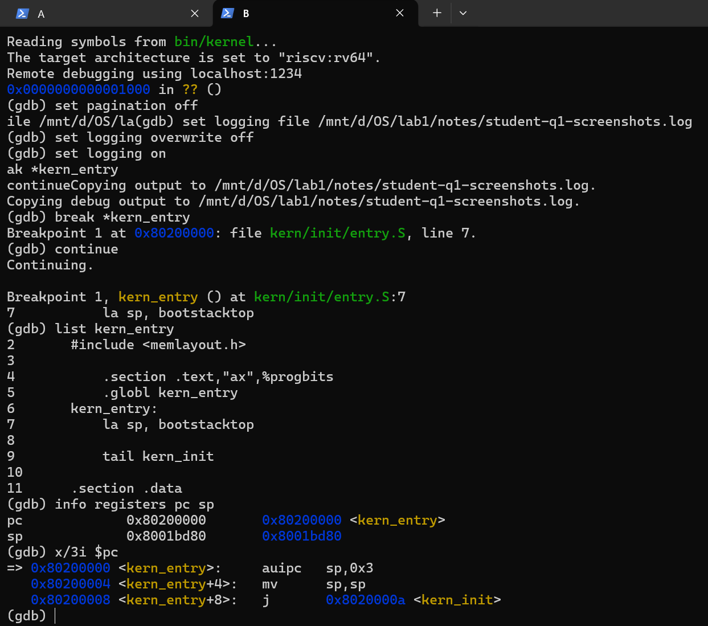
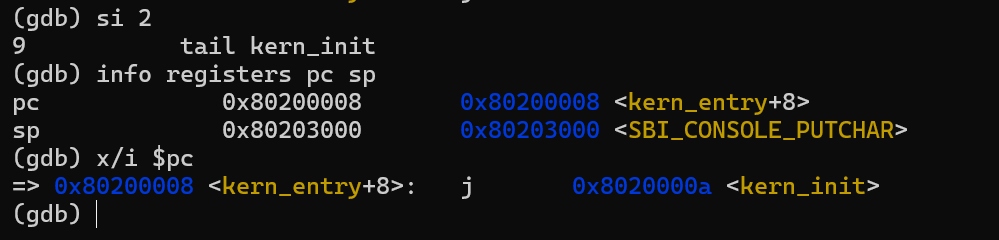
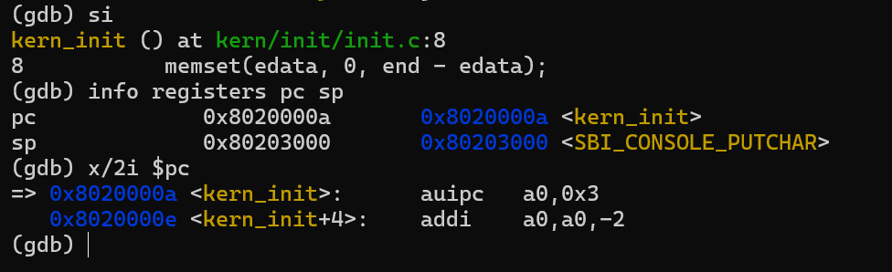
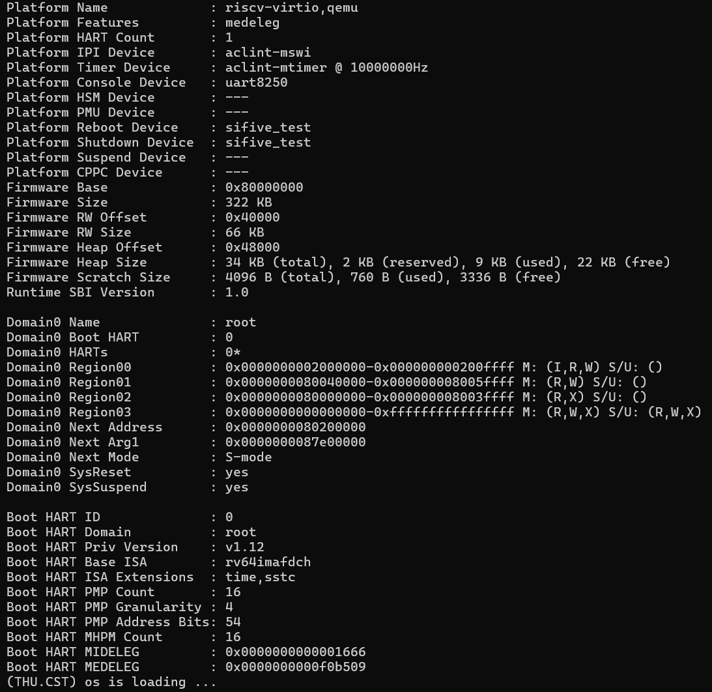
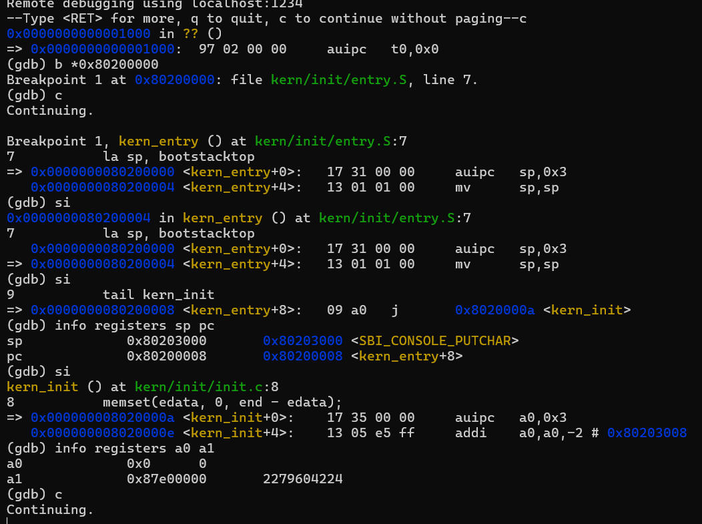

# 实验报告

## 实验基本信息

| 项目 | 内容 |
|------|------|
| **实验名称** | Lab 1: 比麻雀更小的麻雀（最小可执行内核） |
| **小组成员** | 2512075-詹力臻、2511440-张博翔、2511794-宋昕睿 |
| **完成日期** | 2026-10-08 |

### 小组分工

练习如何分工？

| 成员 | 负责的练习/模块 |
|------|----------------|
| 2511440-张博翔 | 练习1 |
| 2511794-宋昕睿 | 练习2 |
| 2512075-詹力臻 | 练习1,2 |

实验报告如何分工？
| 成员 | 负责的练习/模块 |
|------|----------------|
| 2511440-张博翔 | 练习1 |
| 2511794-宋昕睿 | 练习2 |
| 2512075-詹力臻 | 剩余 |
---

## 一、实验目的

<!-- 说明本次实验的主要目标和预期成果 -->

本实验的主要目的是：

1. 理解最小可执行内核的组成以及在 RISC-V 上的内核启动流程。
2. 理解程序的编译、链接和加载过程，并了解交叉编译生成 RISC-V 内核镜像的基本流程。
3. 学习使用 GDB 调试工具验证启动过程。

---

## 二、实验环境

你们使用的 AI 工具

| 成员 | AI 编程工具 | 底层模型 | 备注 |
|------|------------|---------|------|
| 2512075-詹力臻 | Codex | GPT-5.6 sol | 无 |
| 2511440-张博翔 | Codex | GPT-5.6 sol | 无 |
| 2511794-宋昕睿 | Deepseek Harness、codex | Deepseek v4.1 flash, GPT-5.6 Terra| 无|

**说明：**
- **AI 编程工具**：指具体使用的终端工具、编辑器插件、桌面应用或浏览器界面
- **底层模型**：指该工具使用的大语言模型及版本

---

## 三、实验整体逻辑分析

### 2.1 本章节的逻辑主线

本章围绕“如何构建并启动一个最小可执行内核”这一核心问题展开。

实验通过 QEMU 模拟 RISC-V 计算机，由复位代码和 OpenSBI 完成最初的硬件及运行环境初始化，最终将 CPU 的执行权交给位于 0x80200000 的 ucore 内核入口。进入内核后，entry.S 建立内核栈并跳转到 C 语言编写的 kern_init()，由其继续完成 .bss 清零和控制台输出等初始化工作。


---

## 四、实验内容与实现截图

<!-- 
说明：本部分按照 exercises 文档中的练习顺序组织
每个功能模块或者练习中可能包含多项任务，请根据实际情况调整
-->


### 练习：练习1

**负责人：** 2511440-张博翔

**题目：** 阅读 `kern/init/entry.S`，结合操作系统内核启动流程，说明指令 `la sp, bootstacktop` 完成了什么操作，目的是什么？`tail kern_init` 完成了什么操作，目的是什么？

**简要回答：**

- `la sp, bootstacktop`：将启动栈顶地址写入栈指针 `sp`，为后续 C 函数调用、寄存器保存和局部数据提供栈空间。
- `tail kern_init`：跳转到 `kern_init`，不设置新的返回地址，将控制权交给 C 语言编写的内核初始化函数。

`kern/init/entry.S` 中的入口代码只有两条指令：

```asm
kern_entry:
    la sp, bootstacktop
    tail kern_init
```

OpenSBI 完成初始化后，跳到 `0x80200000` 的 `kern_entry`。这里先设置内核栈，再进入 C 函数 `kern_init`。

#### 1. `la sp, bootstacktop`

这条指令把 `bootstacktop` 的地址写入栈指针 `sp`。`la` 是装入地址的伪指令，得到的是栈顶地址。

启动栈在 `entry.S` 中通过 `.space KSTACKSIZE` 预留。`KSTACKSIZE = 2 * PGSIZE = 8192` 字节，本次编译后的栈范围为 `[0x80201000, 0x80203000)`，所以 `bootstacktop = 0x80203000`。

栈向低地址增长，因此 `sp` 初始指向这块空间的高地址边界。进入 C 函数后，函数调用、寄存器保存和部分局部变量都需要使用栈。设置这条指令的目的，就是让内核使用自己的启动栈，为后面的 C 代码准备好运行条件。

本次反汇编中，`la` 对应两条机器指令：

```asm
0x80200000: auipc sp,0x3
0x80200004: mv    sp,sp
```

`auipc` 根据当前指令地址计算出 `0x80200000 + (0x3 << 12) = 0x80203000`，后面的 `mv sp,sp` 保持这个值。因此需要执行两条机器指令，才能走完源码中的这一条伪指令。

#### 2. `tail kern_init`

这条指令跳转到 `kern_init`，开始执行 C 语言写的内核初始化代码。`tail` 是尾调用伪指令，不为这次跳转设置新的返回地址。本次编译结果是一条直接跳转指令：

```asm
0x80200008: j 0x8020000a <kern_init>
```

`kern_init` 中会执行未初始化数据区的清零、打印启动信息，最后停在 `while (1)`。它被声明为不返回的函数，所以这里直接把执行权交给它，不需要安排返回入口汇编后的操作。跳转本身不会改变 `sp`，进入函数后继续使用刚设置好的内核栈。

#### 3. GDB 调试记录

调试使用 QEMU 4.1.1 和 OpenSBI v0.4。先通过 `make debug` 启动 QEMU，再在另一个终端执行 `make gdb`。

在 `kern_entry` 设置断点并运行到入口：

```gdb
break *kern_entry
continue
info registers pc sp
x/3i $pc
```

此时 `pc = 0x80200000`，`sp = 0x8001bd80`。CPU 停在第一条入口指令前，尚未设置内核自己的栈。



执行 `si 2` 后，再查看寄存器，得到 `pc = 0x80200008`、`sp = 0x80203000`。这说明 `la sp, bootstacktop` 已经执行完，栈指针与栈顶地址一致。

截图中 GDB 把这个地址标成了 `<SBI_CONSOLE_PUTCHAR>`，是因为该符号也位于 `0x80203000`；这里判断栈指针是否正确，要看它的地址值。



再执行一次 `si`，`pc` 变为 `0x8020000a`，GDB 显示进入 `kern/init/init.c` 中的 `kern_init`，`sp` 仍为 `0x80203000`。这与 `tail kern_init` 的作用一致：跳入初始化函数，并继续使用已经设置好的栈。



---

练习 2：使用 GDB 验证启动流程

**负责人：** 【2511794-宋昕睿】

**题目：** 使用 GDB 跟踪 QEMU 模拟的 RISC-V 从加电开始，直到执行内核第一条指令（跳转到 `0x80200000`）的整个过程。
回答问题：RISC-V 硬件加电后最初执行的几条指令位于什么地址？它们主要完成了哪些功能？
并简要记录调试过程、观察结果和问题答案。

#### 调试环境搭建过程

```bash
which qemu-system-riscv64
qemu-system-riscv64 --version           # 必须输出 QEMU emulator version 4.1.1
#    环境自检：本次运行的固件横幅为 "OpenSBI v0.4 (Jul 2 2019)"，

# 1) 进入实验目录并挂上工具链
cd /mnt/e/OS/RISCV/labcode/lab1
export PATH=/mnt/e/OS/RISCV/riscv64-unknown-elf-toolchain-10.2.0-2020.12.8-x86_64-linux-ubuntu14/bin:$PATH

# 2) 终端 1：启动 QEMU，停在复位向量（-s 开 gdbstub:1234，-S 上电不执行）
make debug

# 3) 终端 2：连接 GDB
riscv64-unknown-elf-gdb bin/kernel \
  -ex 'set arch riscv:rv64' \
  -ex 'set disassemble-next-line on' \
  -ex 'target remote localhost:1234'
```

#### 跟踪过程

**阶段一：从复位向量 `0x1000` 跟到固件入口 `0x80000000`**

| # | GDB 动作 | 观察结果 |
| --- | --- | --- |
| 1 | 连上 gdbstub 后直接回车 | `0x0000000000001000 in ?? ()`、`=> 0x1000: 97 02 00 00 auipc t0,0x0` —— **加电后的第一条指令就在 `0x1000`** |
| 2 | `info registers pc` | `pc = 0x1000` |
| 3 | `x/10i 0x1000` | 前 5 条是真实指令，`0x1014` 起是数据（详见下方"观察 1"） |
| 4 | `si` | PC → `0x1004`，下一条 `addi a1,t0,32`（`93 85 02 02`） |
| 5 | `si` | PC → `0x1008`，下一条 `csrr a0,mhartid`（`73 25 40 f1`） |
| 6 | `si` | PC → `0x100c`，下一条 `ld t0,24(t0)`（`83 b2 82 01`） |
| 7 | `si` | PC → `0x1010`，下一条 `jr t0`（`67 80 02 00`） |
| 8 | `si` | **PC 直接跳到 `0x80000000`**，下一条 `csrr a6,mhartid` —— `jr t0` 生效，控制权交给 OpenSBI |
| 9 | `info registers pc t0 a0 a1 a2` | `pc = 0x80000000`、`t0 = 0x80000000`、`a0 = 0x0`、`a1 = 0x1020`、`a2 = 0x0` |

**阶段二：跨越固件主体，在内核入口 `0x80200000` 取证**

| # | GDB 动作 | 观察结果 |
| --- | --- | --- |
| 10 | `b *0x80200000` | `Breakpoint 1 at 0x80200000: file kern/init/entry.S, line 7.` —— 断点地址与内核符号一致 |
| 11 | `c` | 运行到内核入口（控制流跨过固件初始化） |
| 12 | 断点命中后观察 | `Breakpoint 1, kern_entry () at kern/init/entry.S:7`，`la sp, bootstacktop`；`=> 0x80200000: 17 31 00 00 auipc sp,0x3`、`0x80200004: 13 01 01 00 mv sp,sp` |

本次跟踪到**断点命中 `0x80200000`** 为止

#### 观察结果分析

**观察  ：`x/10i 0x1000` 里的 `unimp` 不是指令，是数据**

```asm
0x1000: auipc  t0,0x0        ┐
0x1004: addi   a1,t0,32      │ 真正的复位向量：5 条指令
0x1008: csrr   a0,mhartid    │
0x100c: ld     t0,24(t0)     │
0x1010: jr     t0            ┘
0x1014: unimp                ┐
0x1016: unimp                │ 复位向量后面紧跟的
0x1018: unimp                │ "启动信息表"数据
0x101a: 0x8000               │
0x101c: unimp                ┘
```


* `0x1014` 起之所以显示 `unimp`，是因为那里是 **dword 常量**（全 0 或 `0x80000000`）；
  GDB 逐条解码时先遇到 2 个 0 字节就只有 2 字节可读，于是显示 `unimp` 并只前进 2 字节，
  所以连 `0x101a` 都单独出现了一行 —— 它其实是某个 64 位常量的高半部分（`0x8000` 拼成 `0x0000000080000000`）。

#### 问题答案

**Q1：RISC-V 硬件加电后最初执行的几条指令位于什么地址？**

**位于 `0x0000000000001000`（即 `0x1000`），本次实测到的复位向量共 5 条指令，占用 `0x1000 ~ 0x1013`。**


**Q2：它们主要完成了哪些功能？**

核心只有一件事：**为下一阶段（OpenSBI 固件）准备好启动参数，然后把控制权交出去。**

| 地址 | 指令 | 机器码 | 完成的功能（本次实测结果） |
| --- | --- | --- | --- |
| `0x1000` | `auipc t0,0x0` | `97 02 00 00` | 用 PC 相对寻址得到复位向量数据表基址：`t0 = 0x1000 + 0x2000 = 0x3000`（不需要任何初始化即可执行） |
| `0x1004` | `addi a1,t0,32` | `93 85 02 02` | `a1 = 0x1020`：**把"启动信息指针"放进 `a1`**（OpenSBI 0.4 的 `fw_boot_info` 约定） |
| `0x1008` | `csrr a0,mhartid` | `73 25 40 f1` | `a0 = 0`：**读出当前 hart 号放进 `a0`**（满足 M 模式固件的 hartid 约定，本次跑的是 hart 0） |
| `0x100c` | `ld t0,24(t0)` | `83 b2 82 01` | `t0 = *(uint64_t *)(0x3000 + 24) = 0x80000000`：**从数据表取出固件入口地址**（实测 `t0 = 0x80000000`） |
| `0x1010` | `jr t0` | `67 80 02 00` | **无条件跳转到 `0x80000000`**，控制权移交 OpenSBI（实测 `si` 之后 PC 变为 `0x80000000`） |


**结论：** 复位向量位于 `0x1000`，共 5 条指令，功能是"准备启动参数（`a0`/`a1`/`a2`）+ 取固件入口 + 跳转到 `0x80000000`"；
随后由 OpenSBI 完成初始化并把控制流交到 `0x80200000`，内核第一条指令 `la sp, bootstacktop` 在此被执行。

### 环境配置及调试结果


---

## 五、实验总结与收获

### 对操作系统的理解

1. 本实验中重要的知识点，以及与对应的 OS 原理中的知识点，并简要说明二者的含义、关系和差异
    1. 内核启动：操作系统本身无法在尚未运行时加载自己，因此需要固件或引导程序完成最初的硬件初始化和内核加载。实验中的 OpenSBI 承担了类似固件和底层运行环境的作用，而 ucore 从 kern_entry 开始真正取得 CPU 控制权。
    2. 编译、链接：内核源码先在宿主系统上经过交叉编译生成目标文件，再由链接器按照 kernel.ld 确定代码、数据和入口地址，最终生成可加载的内核镜像。与普通应用程序不同，内核不能依赖已有操作系统安排运行地址，因此需要自行规定内存布局。
    3. 特权级：RISC-V 通过不同特权级限制代码对硬件资源的访问。实验中 OpenSBI 运行在 M 模式，ucore 运行在 S 模式，内核通过 ecall 请求 OpenSBI 提供服务。这与用户程序通过系统调用进入内核的思想类似，但这里发生的是 S 模式到 M 模式的调用。

2. OS 原理中很重要、但在本实验中没有对应上的知识点
   1. 本实验还没有涉及进程与线程调度、虚拟内存和页表、中断与异常、系统调用等。

### AI 协作开发的经验

在本实验中，AI 更适合作为理解和调试过程中的辅助工具。可以利用 AI 解释现象，对于操作系统这类底层实验，AI 可以降低阅读汇编、调试输出和工具链的门槛，但最终仍需要通过代码、寄存器状态和实际执行结果进行验证。

---

